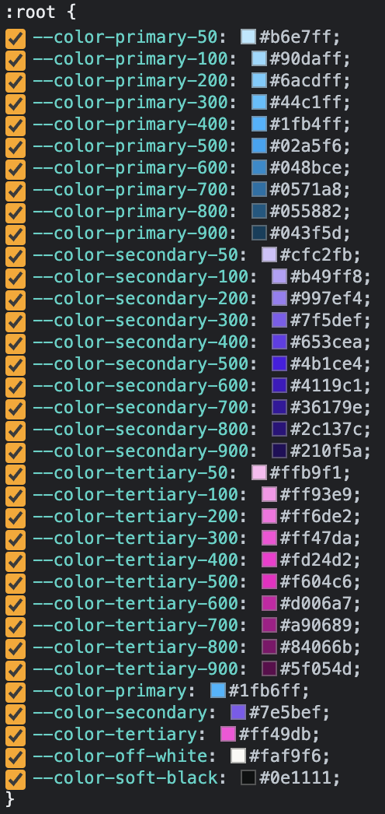

# themewind

Easily create tailwind themes in your projects along with optional automatic shade generation.

**Example Usage**

Add the package using your preferred package manager e.g.

    yarn add @weirdwolfagency/themewind@latest

In your tailwind.config.js require the plugin:

    const themewind = require('@weirdwolfagency/themewind');

Create themes by instantiating the plugin as shown below:

    plugins: [
      themewind({
        defaultTheme: 'light',
        themes: {
          light: {
            shades: [
              'primary', 'secondary', 'tertiary'
            ],
            colors: {
              primary: '#1fb6ff',
              secondary: '#7e5bef',
              tertiary: '#ff49db',
              'off-white': '#FAF9F6',
              'soft-black': '#0E1111'
            }
          },
          dark: {
            shades: [
              'primary', 'secondary', 'tertiary'
            ],
            colors: {
              primary: '#ffff00',
              secondary: '#00ffff',
              tertiary: '#ff00ff',
              'off-white': '#FAF9F6',
              'soft-black': '#0E1111'
            }
          }
        }
      })
    ]

**Things to note:**

The `defaultTheme` config has the css scope of `:root`. Every other theme has a css scope of `[data-theme="themename"]` allowing you to switch themes easily by setting the data attribute anywhere within your application's `HTML`.

For each theme color shades can be generated automatically by including its key in the `shades` array.

All Tailwind utility classes will be available for each theme color, with or without automatic shading.

Each theme color will also be available as a standalone css variable. For example, the config for the light theme above will generate the css variables as below:

